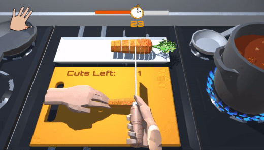
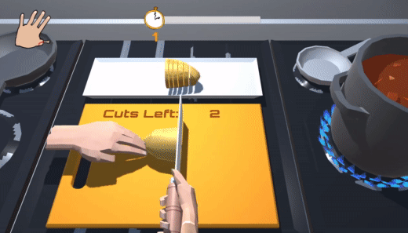
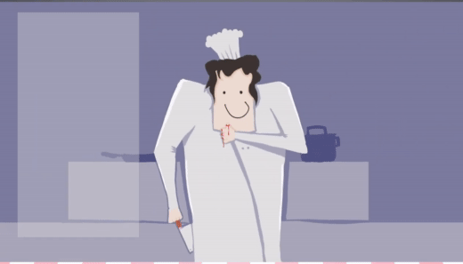

# BVW_round5: OverCut
This is the three-week project I made for BVW course at CMU ETC. We used photon to make this game a multi-player game.

Two players will be coordinating together to cut food and eventually make a curry. One player will control the left hand to hold the food and the other play will control the right hand with knife to cut the food.

## My contribution to this project
#### Knife & Hand controller & Food model segmentation with shader

#### Food fly to pot animation

#### Change Mesh of left hand when it gets cut by knife & blood effect

#### Reset button to reset current food in case of bad cut
Footage to be added...

#### Final scoring board based on players' performance

## Click the image to watch the full gameplay video!

